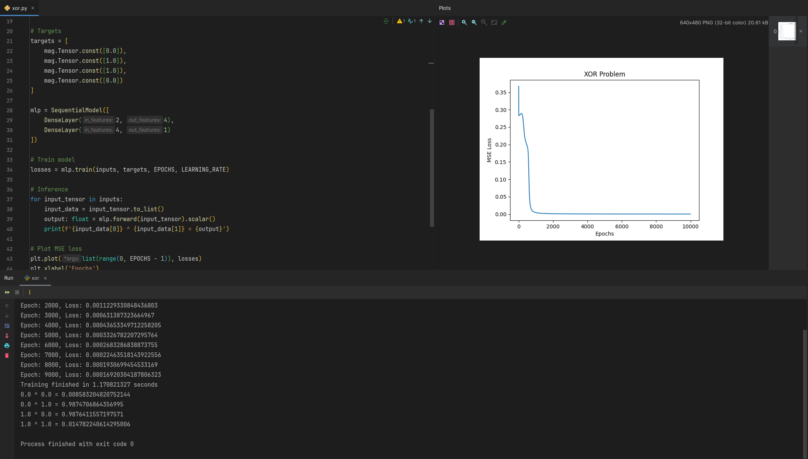

[![Contributors][contributors-shield]][contributors-url]
[![Forks][forks-shield]][forks-url]
[![Stargazers][stars-shield]][stars-url]
[![Issues][issues-shield]][issues-url]

 

  

<h3 align="center">magnetron</h3>
  

    Minimalistic homemade PyTorch alternative, written in C99 and Python.
     
    <a href="https://github.com/MarioSieg/magnetron/tree/master/python/examples/simple"><strong>Explore the docs »</strong></a>
     
     
    <a href="https://github.com/MarioSieg/magnetron/blob/master/python/examples/simple/xor.py">View Demo</a>
    |
    <a href="https://github.com/MarioSieg/magnetron/issues/new?labels=bug&template=bug-report---.md">Report Bug</a>
    |
    <a href="https://github.com/MarioSieg/magnetron/issues/new?labels=enhancement&template=feature-request---.md">Request Feature</a>
  

  
Table of Contents

  <ol>
    <li>
      <a href="#about-the-project">About The Project</a>
    </li>
    <li>
      <a href="#getting-started">Getting Started</a>
      <ul>
        <li><a href="#prerequisites">Prerequisites</a></li>
        <li><a href="#installation">Installation</a></li>
      </ul>
    </li>
    <li><a href="#usage">Usage</a></li>
    <li><a href="#roadmap">Roadmap</a></li>
    <li><a href="#contributing">Contributing</a></li>
    <li><a href="#license">License</a></li>
  </ol>

## About

This project started as a learning experience and a way to understand the inner workings of PyTorch and other deep learning frameworks. 
The goal is to create a minimalistic but still powerful deep learning framework that can be used for research and production. 
The framework is written in C99 and Python and is designed to be easy to understand and modify. 

### Work in Progress
* The project is still in its early stages and many features are missing.
* Developed by a single person in their free time.
* The project is not yet fully optimized for performance.

## Getting Started

To get a local copy up and running follow these simple steps. 
Magnetron itself has **no** Python dependencies except for CFFI to call the C library from Python. 
Some examples use matplotlib and numpy for plotting and data generation, but these are not required to use the framework.

### Prerequisites
* Linux, MacOS or Windows
* A C99 compiler (gcc, clang, msvc)
* Python 3.6 or higher

### Installation
*A pip installable package will be provided, as soon as all core features are implemented.*
1. Clone the repo
2. `cd magnetron/python` (VENV recommended).
3. `pip install -r requirements.txt` Install dependencies for examples.
4. `cd magnetron_framework && bash install_wheel_local.sh && cd ../` Install the Magnetron wheel locally, a pip installable package will be provided in the future.
5. `python examples/simple/xor.py` Run the XOR example.

## Usage
See the [Examples](python/examples) directory for examples on how to use the framework.
For usage in C and C++ see the [Unit Tests](test) directory in the root of the project.

## Roadmap

The goal is to implement training and inference for LLMs and other state of the art models, while providing a simple and small codebase that is easy to understand and modify.

- [X] 6 Dimensional, Linearized Tensors
- [X] Dynamic Computation Graph
- [X] Static Computation Graph
- [X] Modern Python API
- [X] High level neural network building blocks
- [X] CPU Compute and optimization
- [X] SIMD Optimized operators (SSE4, AVX2, AVX512, ARM NEON)
- [X] Compressed tensor file format
- [X] Validation and friendly error messages
- [X] Fast, custom memory allocators for CPU and GPU
- [X] Modern PRNGs: Mersenne Twister and PCG
- [X] Automatic differentiation
- [ ] Compute on GPU (Cuda)
- [ ] Other Datatypes (f16, bf16, int8)
- [ ] Multithreaded CPU Compute with intra-op parallelism
- [ ] Distributed Training and Inference
- [ ] CPU and GPU kernel JIT compilation
- [ ] Better examples with real world models (LLMs and state of the art models)

## Contributing
Contributions are what make the open source community such an amazing place to learn, inspire, and create. Any contributions you make are **greatly appreciated**.
If you have a suggestion that would make this better, please fork the repo and create a pull request. You can also simply open an issue with the tag "enhancement".

## License
Distributed under the Apache 2 License. See `LICENSE.txt` for more information.

## Similar Projects

* [GGML](https://github.com/ggerganov/ggml)
* [TINYGRAD](https://github.com/tinygrad/tinygrad)
* [MICROGRAD](https://github.com/karpathy/micrograd)

(<a href="#readme-top">back to top</a>)

[contributors-shield]: https://img.shields.io/github/contributors/MarioSieg/magnetron.svg?style=for-the-badge
[contributors-url]: https://github.com/MarioSieg/magnetron/graphs/contributors
[forks-shield]: https://img.shields.io/github/forks/MarioSieg/magnetron.svg?style=for-the-badge
[forks-url]: https://github.com/MarioSieg/magnetron/network/members
[stars-shield]: https://img.shields.io/github/stars/MarioSieg/magnetron.svg?style=for-the-badge
[stars-url]: https://github.com/MarioSieg/magnetron/stargazers
[issues-shield]: https://img.shields.io/github/issues/MarioSieg/magnetron.svg?style=for-the-badge
[issues-url]: https://github.com/MarioSieg/magnetron/issues
[license-shield]: https://img.shields.io/github/license/MarioSieg/magnetron.svg?style=for-the-badge
[license-url]: https://github.com/MarioSieg/magnetron/blob/master/LICENSE.txt
